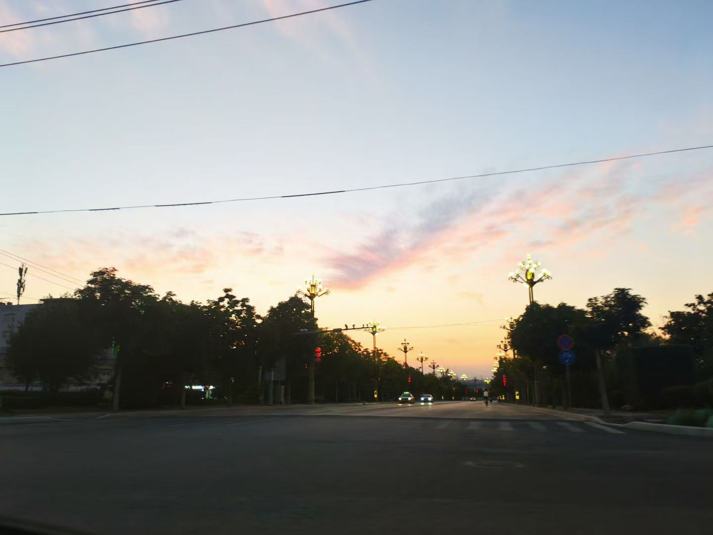

# 佳乐个人网站维护说明书

这份说明给以后自己更新网站用。

你不需要一次学完前端。先记住一句话：

```text
HTML 写内容，CSS 管样子，JavaScript 管公共部分和小动画，assets 放图片。
```

## 0. 保姆级全流程：从想更新到看到效果

假设你今天想新增一条生活碎片，比如：

```text
2026-8-20 · 傍晚散步
散步的时候，风刚刚好。
配一张图片：walk.jpg
```

你按下面流程来。

### 第 1 步：打开网站文件夹

在电脑里打开这个文件夹：

```text
C:\Users\17791\Desktop\Myweb\personal-site
```

你应该能看到这些文件：

```text
index.html
about.html
efforts.html
results.html
fragments.html
css
js
assets
```

如果你看不到这些，说明打开错文件夹了。

### 第 2 步：把图片放到正确位置

打开：

```text
C:\Users\17791\Desktop\Myweb\personal-site\assets\fragments
```

把你的图片复制进去。

建议把图片改成英文名，比如：

```text
20260820-walk.jpg
```

不要用：

```text
微信图片_20260820123456.jpg
新建文件(1).jpg
我的照片.jpg
```

不是不能用中文，而是英文文件名更不容易出问题。

### 第 3 步：打开 `fragments.html`

回到：

```text
C:\Users\17791\Desktop\Myweb\personal-site
```

找到：

```text
fragments.html
```

用 VS Code、记事本或其他文本编辑器打开。

推荐用 VS Code，因为它会帮你看清楚代码结构。

### 第 4 步：找到生活碎片列表

在 `fragments.html` 里找这一段：

```html
<section class="fragment-grid section-rule">
```

这下面就是一条条生活碎片。

每一条大概长这样：

```html
<article class="fragment-card fragment-card-photo fragment-card-wide" data-reveal>
  ...
</article>
```

你可以把一整段 `article` 理解成“一张生活碎片卡片”。

### 第 5 步：复制一条最接近的模板

如果你只有一张图，可以先复制这个模板：

```html
<article class="fragment-card fragment-card-photo fragment-card-wide" data-reveal>
  <span>2026-8-20 · 傍晚散步</span>
  <h2>散步的时候，风刚刚好。</h2>
  <div class="photo-pair" aria-label="傍晚散步照片">
    
  </div>
</article>
```

把它粘贴到：

```html
<section class="fragment-grid section-rule">
```

下面，通常放在最上面，这样最新内容会最先看到。

### 第 6 步：改 4 个地方

你每次新增碎片，主要改这 4 个地方：

```html
<span>2026-8-20 · 傍晚散步</span>
```

这里改日期和小标题。

```html
<h2>散步的时候，风刚刚好。</h2>
```

这里改正文标题。

```html
src="assets/fragments/20260820-walk.jpg"
```

这里改图片路径。

```html
alt="傍晚散步时的路"
```

这里改图片说明。

### 第 7 步：保存文件

按：

```text
Ctrl + S
```

保存。

如果没有保存，浏览器刷新也不会变。

### 第 8 步：刷新浏览器

回到浏览器，打开或刷新：

```text
C:\Users\17791\Desktop\Myweb\personal-site\fragments.html
```

直接按：

```text
F5
```

或者：

```text
Ctrl + R
```

如果没变化，先检查是不是忘了保存。

### 第 9 步：检查三件事

刷新后看：

1. 文字有没有出现
2. 图片有没有显示
3. 排版有没有乱

如果文字出现、图片没出现，大概率是图片路径写错。

如果页面下面全乱了，大概率是少了 `</article>` 或 `</div>`。

### 第 10 步：最常见错误示范

错误 1：图片路径写成电脑绝对路径。

不要这样：

```html

```

应该这样：

```html

```

错误 2：文件名不一致。

图片真实文件名：

```text
20260820-walk.jpg
```

HTML 却写成：

```html

```

这就会显示不出来。

错误 3：少了结束标签。

错误：

```html
<h2>散步的时候，风刚刚好。
```

正确：

```html
<h2>散步的时候，风刚刚好。</h2>
```

错误：

```html
<article class="fragment-card">
  <span>2026-8-20 · 傍晚散步</span>
  <h2>散步的时候，风刚刚好。</h2>
```

正确：

```html
<article class="fragment-card">
  <span>2026-8-20 · 傍晚散步</span>
  <h2>散步的时候，风刚刚好。</h2>
</article>
```

### 第 11 步：如果你想加两张图

用这个：

```html
<article class="fragment-card fragment-card-photo fragment-card-wide" data-reveal>
  <span>2026-8-20 · 和朋友出门</span>
  <h2>今天很普通，但我很喜欢。</h2>
  <div class="photo-pair" aria-label="和朋友出门照片">
    
    
  </div>
</article>
```

### 第 12 步：如果你想加三张图

用这个：

```html
<article class="fragment-card fragment-card-photo fragment-card-wide" data-reveal>
  <span>2026-8-20 · 日出</span>
  <h2>早起看到一点光，感觉今天会很好。</h2>
  <div class="photo-strip" aria-label="日出照片">
    
    
    
  </div>
</article>
```

### 第 13 步：如果你想加四张图

用这个：

```html
<article class="fragment-card fragment-card-photo fragment-card-wide" data-reveal>
  <span>2026-8-20 · 一次出发</span>
  <h2>路上有点累，但很值得。</h2>
  <div class="photo-grid-four" aria-label="出发照片">
    
    
    
    
  </div>
</article>
```

### 第 14 步：如果是证书、截图、海报

证书、截图、海报不要用普通风景图样式，因为可能会被裁掉。

用这个：

```html
<article class="fragment-card fragment-card-photo fragment-card-wide" data-reveal>
  <span>2026 春学期</span>
  <h2>憧憬着，为憧憬做些努力！</h2>
  <div class="photo-strip photo-docs" aria-label="春学期记录照片">
    
    
    
  </div>
</article>
```

关键是：

```html
photo-docs
```

它会让图片完整显示，不会裁切掉文字。

## 1. 网站目录怎么看

现在主要文件是这些：

```text
personal-site/
  index.html              首页
  about.html              关于我
  efforts.html            成长记录
  results.html            方法记录
  fragments.html          生活碎片
  css/
    styles.css            全站样式
  js/
    site.js               导航、页脚、淡入动画
  assets/
    fragments/            生活碎片图片
```

平时最常改的是：

```text
fragments.html
about.html
css/styles.css
```

不熟的时候，不要一上来改 `site.js`。它是全站公共脚本，改错了所有页面都会受影响。

## 2. HTML 是什么

HTML 负责页面内容和结构。

常见标签：

```html
<h1>大标题</h1>
<h2>小一点的标题</h2>
<p>普通段落文字</p>
<a href="about.html">这是一个链接</a>

```

举个例子：

```html
<h2>你好，我是佳乐。</h2>
<p>我热衷于好好生活，也喜欢做一些让自己开心、幸福的事。</p>
```

网页看到的就是一个标题和一段文字。

## 3. CSS 是什么

CSS 负责样子。

比如 HTML 里有：

```html
<article class="fragment-card">
  <h2>生活不只由大事组成。</h2>
</article>
```

CSS 里可能有：

```css
.fragment-card {
  padding: 30px;
  background: rgba(255, 255, 255, 0.46);
  border: 1px solid var(--line-strong);
}
```

意思是：所有 `class="fragment-card"` 的区域，都有这些样式。

你可以理解成：

```text
HTML 负责“这里有什么”
CSS 负责“它长什么样”
```

## 4. JavaScript 是什么

现在只有一个主要脚本：

```text
js/site.js
```

它负责：

1. 生成顶部导航
2. 生成底部页脚
3. 给页面元素加淡入动画

比如导航在 `site.js` 里：

```js
const navigation = [
  { id: "home", label: "首页", href: "index.html" },
  { id: "about", label: "关于我", href: "about.html" },
  { id: "efforts", label: "成长记录", href: "efforts.html" },
  { id: "results", label: "方法记录", href: "results.html" },
  { id: "fragments", label: "生活碎片", href: "fragments.html" }
];
```

如果你想把“方法记录”改成“学习方法”，就改这一行：

```js
{ id: "results", label: "学习方法", href: "results.html" },
```

## 5. 想改首页怎么办

首页文件：

```text
index.html
```

比如你想改首页第一句话，找到这一段：

```html
<p class="hero-summary">
  一个给自己，也给想了解我的人看的地方。这里记录我是谁、怎样成长，以及从真实行动里慢慢留下的方法和生活片段。
</p>
```

直接改文字就行：

```html
<p class="hero-summary">
  这里记录我的生活、成长和一些慢慢变得重要的事情。
</p>
```

注意：只改两个标签中间的文字，不要删掉 `<p>` 和 `</p>`。

## 6. 想改关于我怎么办

关于我文件：

```text
about.html
```

如果你想改自我介绍，找到：

```html
<h2>你好，我是佳乐。</h2>
<p>我热衷于好好生活，也喜欢做一些让自己开心、幸福的事。</p>
```

可以改成：

```html
<h2>你好，我是佳乐。</h2>
<p>我喜欢认真生活，也喜欢把一些普通但开心的事情留下来。</p>
```

如果想改座右铭，找到：

```html
<blockquote>让自己开心是美好生活的答案。</blockquote>
<div class="motto-explain motto-lines">
  <p>最开心的事就是好好地生活，生活真的太有意思了。</p>
  <p>憧憬而成长 <span aria-hidden="true">||</span> 享受而喜欢</p>
</div>
```

比如改成：

```html
<blockquote>生活值得认真过。</blockquote>
<div class="motto-explain motto-lines">
  <p>把小事做好，把喜欢留下。</p>
  <p>慢慢成长 <span aria-hidden="true">||</span> 好好生活</p>
</div>
```

## 7. 想加一条生活碎片怎么办

生活碎片文件：

```text
fragments.html
```

图片放这里：

```text
assets/fragments/
```

### 7.1 只有文字的碎片

可以复制这种结构：

```html
<article class="fragment-card" data-reveal>
  <span>2026-8-1 · 一句话</span>
  <h2>今天有一点开心。</h2>
  <p>可能只是吃到喜欢的东西，也可能只是天气刚刚好。</p>
</article>
```

然后改成你的内容：

```html
<article class="fragment-card" data-reveal>
  <span>2026-8-12 · 乒乓球</span>
  <h2>打完球之后，整个人都轻了一点。</h2>
  <p>身体累了，但心情很好。健康这件事，真的不是口号。</p>
</article>
```

### 7.2 带一张图片的碎片

先把图片复制到：

```text
assets/fragments/
```

假设图片叫：

```text
20260812-pingpong.jpg
```

然后写：

```html
<article class="fragment-card fragment-card-photo fragment-card-wide" data-reveal>
  <span>2026-8-12 · 乒乓球</span>
  <h2>打完球之后，整个人都轻了一点。</h2>
  <div class="photo-pair" aria-label="乒乓球照片">
    
  </div>
</article>
```

如果只有一张图，用 `photo-pair` 也能显示，只是会占一格。以后想更精细，可以再加专门的一图样式。

### 7.3 带两张图片的碎片

参考“生日礼物”这种：

```html
<article class="fragment-card fragment-card-photo fragment-card-wide" data-reveal>
  <span>2026-7-3 · 生日礼物</span>
  <h2>享受美好的友谊，给朋友准备礼物的快乐。</h2>
  <div class="photo-pair" aria-label="生日礼物照片">
    
    
  </div>
</article>
```

你只需要改：

```text
日期
标题
图片路径
alt 图片说明
```

### 7.4 带三张图片的碎片

参考“日出看云”这种：

```html
<article class="fragment-card fragment-card-photo fragment-card-wide" data-reveal>
  <span>2026-7-17 · 日出看云</span>
  <h2>享受安静的生活，遐想的云朵，emo 山上的风。</h2>
  <div class="photo-strip" aria-label="日出看云照片">
    
    
    
  </div>
</article>
```

### 7.5 带四张图片的碎片

参考“夜爬华山”这种：

```html
<article class="fragment-card fragment-card-photo fragment-card-wide" data-reveal>
  <span>2026-7-5 · 夜爬华山</span>
  <h2>享受生命的纯粹，自然的纯粹，是理想与现实的美妙交织。</h2>
  <div class="photo-grid-four" aria-label="夜爬华山照片">
    
    
    
    
  </div>
</article>
```

## 8. 图片路径怎么写

如果图片在这里：

```text
personal-site/assets/fragments/test.jpg
```

HTML 里写：

```html

```

不要写成电脑完整路径：

```html

```

网站里应该用相对路径：

```text
assets/fragments/test.jpg
```

## 9. alt 是什么

图片里有：

```html
alt="清晨日出时的云和校园远景"
```

`alt` 是图片说明。它有两个作用：

1. 图片加载失败时，显示这段说明
2. 读屏软件可以读给视障用户听

写法不用复杂，简单说明图片是什么就行。

比如：

```html
alt="朋友生日蛋糕"
alt="华山日出和山间剪影"
alt="数学建模竞赛获奖证书"
```

## 10. 想改个人标签怎么办

生活碎片里的标签在 `fragments.html`：

```html
<div class="tag-cloud" aria-label="个人标签">
  <span>憧憬</span>
  <span>遇见</span>
  <span>乒乓球</span>
  <span>健康</span>
  <span>计算机</span>
</div>
```

想加一个：

```html
<span>日出</span>
```

想删一个，就删掉对应的 `<span>...</span>`。

## 11. 想改导航怎么办

导航在：

```text
js/site.js
```

找到：

```js
const navigation = [
  { id: "home", label: "首页", href: "index.html" },
  { id: "about", label: "关于我", href: "about.html" },
  { id: "efforts", label: "成长记录", href: "efforts.html" },
  { id: "results", label: "方法记录", href: "results.html" },
  { id: "fragments", label: "生活碎片", href: "fragments.html" }
];
```

比如想把“生活碎片”改成“生活记录”：

```js
{ id: "fragments", label: "生活记录", href: "fragments.html" }
```

注意：只改 `label` 最安全。

## 12. 想改页脚怎么办

页脚也在：

```text
js/site.js
```

找到：

```js
footer.innerHTML = `
  <footer class="site-footer shell">
    <p>佳乐的自我记录站</p>
    <p>让自己开心是美好生活的答案。</p>
    <div class="footer-links">
      <a href="https://github.com/LJL0509" target="_blank" rel="noreferrer">GitHub</a>
      <a href="mailto:17791624829@163.com">Email</a>
    </div>
  </footer>
`;
```

如果想改页脚座右铭，就改第二个 `<p>`：

```html
<p>生活真的太有意思了。</p>
```

## 13. 想改颜色怎么办

颜色主要在：

```text
css/styles.css
```

最上面有：

```css
:root {
  --paper: #f3f0e8;
  --ink: #1d211e;
  --green: #17634d;
  --red: #bb4939;
  --blue: #315ca8;
  --yellow: #e3bb50;
}
```

这些是全站颜色变量。

比如想把绿色改得更深：

```css
--green: #0f4f3e;
```

想改红色：

```css
--red: #a33a2f;
```

建议一次只改一个颜色，然后刷新浏览器看效果。

## 14. 想改图片裁切怎么办

如果图片被裁了，通常是 CSS 里的：

```css
object-fit: cover;
```

`cover` 的意思是填满容器，可能裁掉边缘。

如果想完整显示图片，改成：

```css
object-fit: contain;
```

比如文档类图片使用：

```css
.photo-docs img {
  object-fit: contain;
}
```

风景照适合 `cover`，证书、截图、海报适合 `contain`。

## 15. 常见错误

### 图片不显示

检查三件事：

1. 图片有没有放进 `assets/fragments`
2. 文件名有没有写错
3. 后缀是不是 `.jpg` / `.png` 写对了

比如文件叫：

```text
20260717-sunrise.jpg
```

HTML 里不能写成：

```html
20260717-sunrise.png
```

### 页面乱了

大概率是 HTML 标签少了一个闭合。

比如错误：

```html
<article class="fragment-card">
  <h2>标题</h2>
  <p>文字
</article>
```

这里 `<p>` 没有 `</p>`。

正确：

```html
<article class="fragment-card">
  <h2>标题</h2>
  <p>文字</p>
</article>
```

### 链接点不开

检查 `href`：

```html
<a href="about.html">关于我</a>
```

如果文件叫 `about.html`，href 也必须是 `about.html`。

## 16. 推荐更新流程

以后你想加一条生活碎片，可以按这个顺序：

1. 把图片复制到 `assets/fragments`
2. 给图片改一个清楚的英文文件名
3. 打开 `fragments.html`
4. 复制一段已有的 `article`
5. 改日期、标题、图片路径和 alt
6. 保存
7. 刷新浏览器看效果

举例：

```text
图片：20260820-walk.jpg
日期：2026-8-20
标题：散步的时候，风刚刚好。
```

HTML：

```html
<article class="fragment-card fragment-card-photo fragment-card-wide" data-reveal>
  <span>2026-8-20 · 散步</span>
  <h2>散步的时候，风刚刚好。</h2>
  <div class="photo-pair" aria-label="散步照片">
    
  </div>
</article>
```

## 17. 什么时候适合找我

你自己适合做：

- 改文字
- 加生活碎片
- 换图片
- 改标签
- 改简单链接

适合找我做：

- 页面样式整体调整
- 新增一个页面
- 图片排版很乱
- 手机端显示不舒服
- 想部署到 GitHub Pages
- 想把网站升级成 Markdown 自动生成
- 不知道哪里写错了

## 18. 以后可以升级成更好维护的版本

现在是纯 HTML 网站，优点是简单直接。

缺点是：每次加内容都要复制 HTML。

以后可以升级成：

```text
content/fragments/2026-07-17.md
content/fragments/2026-07-05.md
content/fragments/2026-spring.md
```

每条生活碎片单独一个 Markdown 文件。你只要写：

```text
---
date: 2026-07-17
title: 日出看云
images:
  - 20260717-cloud-v.jpg
  - 20260717-sunrise.jpg
---

享受安静的生活，遐想的云朵，emo 山上的风。
```

网站自动生成页面。

但这属于下一阶段。现在先把 HTML 版用熟，就很好。
